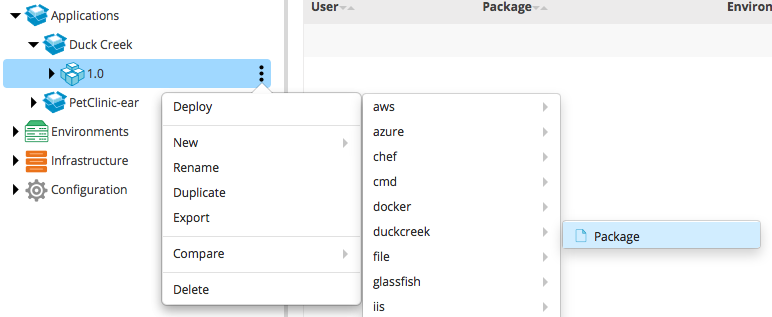
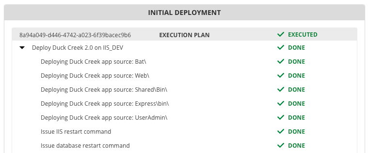

# xld-duckcreek-plugin

[](https://travis-ci.org/xebialabs-community/xld-duckcreek-plugin)
[](https://www.codacy.com/app/jpflug/xld-duckcreek-plugin?utm_source=github.com&amp;utm_medium=referral&amp;utm_content=xebialabs-community/xld-duckcreek-plugin&amp;utm_campaign=Badge_Grade)
[](https://codeclimate.com/github/xebialabs-community/xld-duckcreek-plugin)
[![License: MIT][xld-duckcreek-plugin-license-image] ][xld-duckcreek-plugin-license-url]
[![Github All Releases][xld-duckcreek-plugin-downloads-image]]()

[xld-duckcreek-plugin-license-image]: https://img.shields.io/badge/License-MIT-yellow.svg
[xld-duckcreek-plugin-license-url]: https://opensource.org/licenses/MIT
[xld-duckcreek-plugin-downloads-image]: https://img.shields.io/github/downloads/xebialabs-community/xld-duckcreek-plugin/total.svg

## Preface

This document describes the functionality provided by the Duck Creek plugin.

See the **XL Deploy Reference Manual** for background information on XL Deploy and deployment concepts.


## Requirements

- XL Deploy 5+
- IIS plugin for XL Deploy
- Windows IIS infrastructure
- Robocopy

## Overview

The Duck Creek plugin is an XL Deploy plugin that adds capability for deploying Duck Creek packages to Windows IIS.   Team includes manifest.json file into DAR package generated by Jenkins build job.  During deployment, XL Deploy utilizes the manifest.json file to determine which files and folders need to be copied to the target server file system, then one deployment step is added for every app server and/or web server entry in the JSON.  Additionally, the plugin can issue an IIS restart command and restart the database server with the appropriate JSON fields present.

## Installation

Place the plugin JAR file into your `SERVER_HOME/plugins` directory.

## Usage

 1. Go to `Repository - Application`, create a new `duckcreek.Package` and upload your Duck Creek archive file containing manifest.json .

 

 2. Deploy to your IIS target server, note that one step has been added for every app and web server folder speficied in manifest.json file as well as steps for restarting IIS and database server.


## Manifest Format information

Example manifest.json file:

```json
{
   "appServerFiles":[
      {
         "source":"Bat\\",
         "target":"Bat",
         "copytype":"full"
      },
      {
         "source":"Web\\",
         "target":"Web",
         "copytype":"only-files",
         "file":"Web.DEV*.config"
      },
      {
         "source":"Shared\\Bin\\",
         "target":"Shared\\Bin",
         "copytype":"only-files",
         "file":"AIG.CustomPrintJob.dll"
      }
   ],
   "webServerFiles":[
      {
         "source":"Express\\bin\\",
         "target":"Express\\bin\\",
         "copytype":"full"
      },
      {
         "source":"UserAdmin\\",
         "target":"UserAdmin",
         "copytype":"only-files"
      }
   ],
   "restartIIS":"True",
   "updateDBserver":"True",
}
```

The **copytype** field values can be "full" or "only-files". If value of copytype is only-files, we need to replace the files which matche the criteria in the **file** field. The file field should contain whatever wildcard information is required to specify your file(s) i.e. "file":"Web.DEV*.config" above.

## References

[Introduction to the XL Deploy IIS plugin](https://docs.xebialabs.com/xl-deploy/concept/iis-plugin.html)

[IIS Plugin Reference](https://docs.xebialabs.com/xl-deploy-iis-plugin/6.0.x/iisPluginManual.html)

## TODO
From requirements sheet, if file already exists on the server but has changed, replace the file.  File checksum used to
determine change.
